# Diagram Generator Table Syntax

This document explains the syntax used to define tables for the diagram generator. The example images shown below are generated from the definitions in [`examples_for_readme.txt`](./examples_for_readme.txt) using the [`generate_readme_images.sh`](./generate_readme_images.sh) script.

## Basic Table Structure

A table definition starts with `table:`, followed by an optional ID in square brackets, the table title, and optional global settings in curly braces.

**Syntax:**
`table: [table-id] Table Title {setting1:value1, setting2:value2}`

-   `[table-id]`: (Optional) A unique identifier for the table. This ID is used when referencing this table from other cells (for nested tables) or when specifying the main table to render. If not provided, the first table defined will be the main table by default, unless overridden by the `main_table` directive.
-   `Table Title`: The title that will be displayed for the table (though the rendering of the title itself is not currently supported by the PNG generator).
-   `{settings}`: (Optional) Global settings that apply to the entire table, such as background colors and edge properties. These will be detailed later.

**Example:**
```
table: [my-users] User List {bg_table:#ECECEC}
... table content ...
```

### Main Table Directive

If your input defines multiple tables, you can specify which table should be rendered as the main diagram using the `main_table` directive. This directive should appear before any table definitions.

**Syntax:**
`main_table: [table-id]`

-   `[table-id]`: The ID of the table you want to render.

**Example:**
```
main_table: [summary-table]

table: [detail-table]
... content ...

table: [summary-table]
... content ...
```
If the `main_table` directive is omitted, the first table defined in the file will be considered the main table. If a table ID is specified in `main_table` but no table with that ID is found, an error will occur.

#### Example Syntax
```text
# Example 1: Simple Table
main_table: [simple-table]
table: [simple-table] My First Table {bg_table:#F5F5F5, bg_cell:#FFFFFF, edge_color:#666666}
[HeaderCol1] First Column Header | [HeaderCol2] Second Column Header
Row 1, Cell 1 | Row 1, Cell 2
Row 2, Cell 1 | Row 2, Cell 2 has\nmultiple lines of text.
```

#### Rendered Output
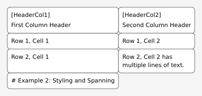

## Cell Content and Structure

Table rows are defined line by line. Within each line, cells are separated by the pipe character (`|`).

**Syntax:**
`[Optional CellTitle] Cell Content | [AnotherTitle] More Content | Just content`

-   Each line after the table definition line represents a row in the table.
-   `|` (pipe character) separates individual cells within a row.
    -   Leading and trailing pipes on a line are optional and are ignored (e.g., `| Cell A | Cell B |` is treated the same as `Cell A | Cell B`).
-   `[Optional CellTitle]`: (Optional) Similar to table IDs, cell titles can be defined at the beginning of a cell's content, enclosed in square brackets. This title is typically rendered prominently within the cell by the diagram generator.
-   `Cell Content`: The text or directives that go inside the cell.

**Example:**
```
table: [data-table] My Data
[Header1] Column 1 Data | [Header2] Column 2 Data | [Header3] Column 3 Data
Row2 Cell1 | Row2 Cell2 | Row2 Cell3
This is a cell with a title. [TitleForCell] | This cell has no title. | [LastTitle] And this one.
```

### Multi-line Content

You can have multi-line content within a single cell by using `\n` to represent a newline character.

**Example:**
```
table: [multi-line-example]
Cell with one line | This cell has\ntwo lines of text. | And this one\nhas\nthree.
```
The renderer will wrap text within cells, but `\n` gives you explicit control over line breaks.

## Cell and Table Styling

You can customize the appearance of tables and individual cells using various styling directives.

### Global Table Settings

Global settings are applied to the entire table and are defined in the table's title line, within curly braces `{}`.

**Available Global Settings:**

-   `bg_table:<color>`: Sets the background color for the entire table canvas (the area around and behind cells).
-   `bg_cell:<color>`: Sets the default background color for all cells in the table. This can be overridden by cell-specific styling.
-   `edge_color:<color>`: Sets the color of the borders for the table and its cells.
-   `edge_thickness:<value>`: Sets the thickness (in pixels) of the borders. Default is 1.

**Color Format:** Colors can be specified in hexadecimal format:
    -   `#RGB` (e.g., `#F00` for red)
    -   `#RRGGBB` (e.g., `#FF0000` for red)

**Example:**
```
table: [styled-table] My Styled Table {bg_table:#EEEEEE, bg_cell:#FFFFCC, edge_color:#333333, edge_thickness:2}
Header A | Header B
Cell 1 | Cell 2
```
In this example, the table will have a light gray background, cells will default to a light yellow background, and borders will be dark gray and 2 pixels thick.

### Cell-Specific Background Color

You can override the default cell background color for individual cells by adding a `{bg:<color>}` directive within the cell's content.

**Syntax:**
`Cell content {bg:<color>}`

**Example:**
```
table: [cell-style-example] Cell Styling Demo {bg_cell:#FAFAFA}
Normal Cell | Special Cell {bg:#DDEEFF} | Another Normal
Cell with {bg:#FFDDDD} custom color | Normal Again | Highlighted {bg:#E0FFE0}
```
In this table, most cells will have the default `#FAFAFA` background. However, "Special Cell" will be light blue (`#DDEEFF`), the cell "Cell with custom color" will be light red (`#FFDDDD`), and "Highlighted" will be light green (`#E0FFE0`). The text "Cell content" and the `{bg:...}` directive are part of the cell's definition; the directive is processed and removed from the final displayed content.

## Cell Spanning

Cells can be made to span across multiple rows or columns using specific directives. These directives are placed within the cell's content.

### Rowspan

A cell can span multiple rows using the `::rowspan=N::` directive, where `N` is the number of rows the cell should cover. The content for cells that are "covered" by a rowspan should be omitted in subsequent rows.

**Syntax:**
`Cell content ::rowspan=N::`

**Example:**
```
table: [rowspan-example] Row Spanning Demo
Category A ::rowspan=2:: | Item 1 | Value 1
                        | Item 2 | Value 2
Category B | Item 3 | Value 3
```
In this example:
- "Category A" will span two rows.
- The second row starts with "Item 2" because the first cell's space is occupied by "Category A".

### Colspan

A cell can span multiple columns using the `::colspan=N::` directive, where `N` is the number of columns the cell should cover. Other cells in the same row should be defined accordingly.

**Syntax:**
`Cell content ::colspan=N::`

**Example:**
```
table: [colspan-example] Column Spanning Demo
Section Title ::colspan=3::
Sub A | Sub B | Sub C
Data 1 | Data 2 ::colspan=2::
Data 4 | Data 5 | Data 6
```
In this example:
- "Section Title" spans all three columns.
- "Data 2" in the third row spans two columns, so no third cell is defined for that row.

**Note:** Both `rowspan` and `colspan` directives are processed and removed from the final displayed content of the cell.

### Combined Styling and Spanning Example

This example demonstrates various global table styles, cell-specific background colors, and how `colspan` and `rowspan` affect the layout.

#### Example Syntax
```text
# Example 2: Styling and Spanning
main_table: [styling-spanning-table]
table: [styling-spanning-table] Styling and Spanning Demo {bg_table:#E0FFE0, edge_color:#006400, edge_thickness:2}
Feature ::colspan=3:: {bg:#A0D0A0}
[Type] Type {bg:#C0E0C0} | [Description] Description {bg:#C0E0C0} | [Notes] Notes {bg:#C0E0C0}
Rowspan Example ::rowspan=2:: {bg:#D0F0D0} | This cell spans two rows. | Initial note for rowspan.
                                          | Spanned content replaces this cell. | Second note for rowspan.
Colspan Example {bg:#D0F0D0} | This cell uses colspan. ::colspan=2:: {bg:#E0F0E0} |
Individual Cell Style | Normal | Special Cell {bg:#FFDAB9}
```

#### Rendered Output
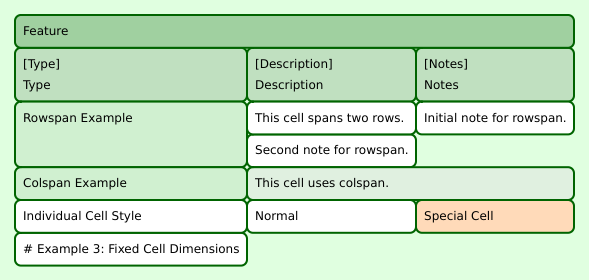

## Fixed Cell Dimensions

You can suggest specific dimensions for cells using `fixed_width` and `fixed_height` directives. The rendering engine will attempt to honor these dimensions. Content within such cells will be wrapped, or clipped if it exceeds the available space.

### Fixed Width

The `::fixed_width=W::` directive suggests a width `W` (in pixels) for the cell.

**Syntax:**
`Cell content ::fixed_width=W::`

**Example:**
```
table: [fixed-width-demo] Fixed Width Cells
Normal Cell | This cell has a fixed width ::fixed_width=100:: | Another normal cell
Short | This is a longer text that will be wrapped or clipped within its fixed width. ::fixed_width=150:: | End
```
In this example, the second cell in each row is given a specific width. Text that doesn't fit will wrap to the next line within the cell, or be clipped if it also exceeds the cell's height.

### Fixed Height

The `::fixed_height=H::` directive suggests a height `H` (in pixels) for the cell.

**Syntax:**
`Cell content ::fixed_height=H::`

**Example:**
```
table: [fixed-height-demo] Fixed Height Cells
Normal Cell | This cell has a fixed height. If the content is too long, it might be clipped vertically. ::fixed_height=50::
Row 2, Cell 1 | Short content ::fixed_height=50::
```
Content that exceeds the fixed height will be clipped.

### Fixed Width and Height

You can combine both directives to suggest a fixed size for a cell.

**Example:**
```
table: [fixed-size-demo] Fixed Size Cells
This cell has both fixed width and height. ::fixed_width=120:: ::fixed_height=60:: | Normal Cell
Short ::fixed_width=80:: ::fixed_height=40:: | Text that might be clipped ::fixed_width=100:: ::fixed_height=30::
```

**Note:** These directives are processed and removed from the final displayed content of the cell. The actual rendered size might vary slightly due to padding and other layout calculations.

#### Example Syntax
```text
# Example 3: Fixed Cell Dimensions
main_table: [fixed-dimensions-table]
table: [fixed-dimensions-table] Fixed Cell Dimensions {bg_table:#FFF5E0, bg_cell:#FFFDF5}
Description | Cell with Fixed Dimensions
Short Text | This cell has a fixed width of 150px and a fixed height of 60px. The text inside will wrap, and if it's too long, it might be clipped. ::fixed_width=150:: ::fixed_height=60::
More Text | Fixed Width only ::fixed_width=100::
Even More | Fixed Height only ::fixed_height=40:: This text might be clipped if it's too long for the height.
Another Row | Both fixed: ::fixed_width=80:: ::fixed_height=30::
```

#### Rendered Output
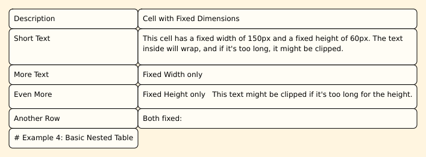

## Nested Tables

One of the powerful features of this syntax is the ability to nest tables within the cells of other tables. This is achieved by referencing another table's ID.

**Syntax:**
`::table=referenced_table_id:: [Optional other directives like fixed_width, inner_align, etc.]`

When a cell's content is `::table=another-id::`, the diagram generator will render the table with the ID `another-id` inside that cell. Any other text content in a cell with a `::table=...::` directive is typically ignored.

**Example:**
```
table: [outer-table] Main Content
Item | Details
Key A | This cell contains a nested table: ::table=details-for-a:: ::fixed_width=200:: ::fixed_height=100::
Key B | Another cell with a different nested table: ::table=details-for-b::

table: [details-for-a] Details for A {bg_table:#F0F8FF}
Property | Value
Color | Red
Size | Large

table: [details-for-b] Details for B {bg_table:#FFF0F5}
Info | Data
Status | Active
Notes | This is a note.
```
In this example, the "Details" column of `outer-table` will render `details-for-a` and `details-for-b` within its cells.

#### Example Syntax
The main table `basic-nested-outer` references `inner-table-1` in its cells.
```text
# Example 4: Basic Nested Table
main_table: [basic-nested-outer]
table: [basic-nested-outer] Outer Table with Nested Content {bg_table:#E6E6FA}
Section | Details Area ::fixed_width=250:: ::fixed_height=120::
Alpha | Contains details from 'inner-table-1' ::table=inner-table-1::
Beta  | Also contains 'inner-table-1', but with different parent cell text. ::table=inner-table-1:: ::inner_align=center:: ::inner_scale=fit_both::

table: [inner-table-1] Inner Table One {bg_table:#FFFACD, bg_cell:#FFFFE0, edge_color:#BDB76B}
Key | Value
PropA | Value A
PropB | Value B \n (on two lines)
```

#### Rendered Output
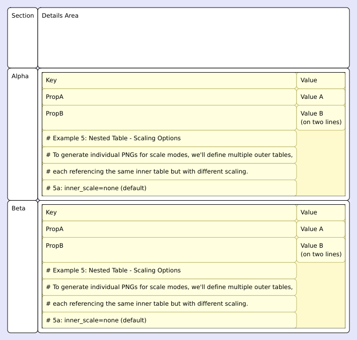

### Inner Table Layout

When nesting tables, you often want to control how the inner table is positioned and scaled within the parent cell. This is done with `inner_align` and `inner_scale` directives, used in conjunction with `::table=...::`. These directives apply to the *content* of the cell (the nested table).

#### Inner Alignment (`::inner_align::`)

Specifies how the nested table should be aligned within the available space of the parent cell (after padding).

**Syntax:**
`::table=id:: ::inner_align=alignment_value::`

**Possible `alignment_value`s:**
-   `top_left`, `top_center`, `top_right`
-   `middle_left`, `center` (same as `middle_center`), `middle_center`, `middle_right`
-   `bottom_left`, `bottom_center`, `bottom_right`

Default is `top_left`.

The following examples demonstrate different alignment modes. They all use `::inner_scale=none::` to show the inner table at its natural size, making alignment effects clearer. The parent cell is `::fixed_width=220:: ::fixed_height=100::`.

**Shared Inner Table Definition:**
```text
table: [inner-table-for-aligning] Inner Table (for aligning demos) {bg_table:#FAFAD2, edge_color:#B0E0E6}
Info A | Info B
X | Y
```
##### Alignment: `top_left` (Default)
The parent cell in this example is `Parent Cell (220x100) ::fixed_width=220:: ::fixed_height=100::`.
The relevant part of the cell definition using the directive is:
```text
::table=inner-table-for-aligning:: ::inner_scale=none:: | Default align (top_left). Using 'none' scale to show natural size.
```
**Rendered Output:**
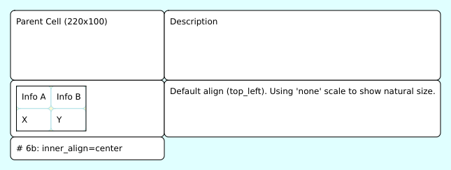

##### Alignment: `center`
The parent cell in this example is `Parent Cell (220x100) ::fixed_width=220:: ::fixed_height=100::`.
The relevant part of the cell definition using the directive is:
```text
::table=inner-table-for-aligning:: ::inner_scale=none:: ::inner_align=center:: | Centered alignment.
```
**Rendered Output:**
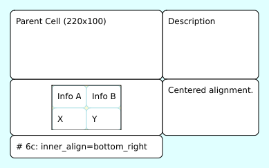

##### Alignment: `bottom_right`
The parent cell in this example is `Parent Cell (220x100) ::fixed_width=220:: ::fixed_height=100::`.
The relevant part of the cell definition using the directive is:
```text
::table=inner-table-for-aligning:: ::inner_scale=none:: ::inner_align=bottom_right:: | Bottom-right alignment.
```
**Rendered Output:**
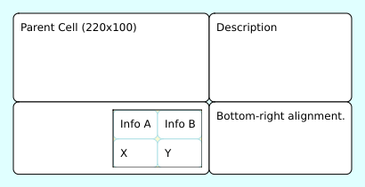

#### Inner Scaling (`::inner_scale::`)

Specifies how the nested table should be scaled to fit within the parent cell's content area.

**Syntax:**
`::table=id:: ::inner_scale=scale_mode::`

**Possible `scale_mode`s:**
-   `none`: The inner table is rendered at its natural size. It might be clipped if larger than the parent cell's content area.
-   `fit_width`: The inner table is scaled (up or down) so its width matches the parent cell's content area width. Aspect ratio is maintained.
-   `fit_height`: The inner table is scaled (up or down) so its height matches the parent cell's content area height. Aspect ratio is maintained.
-   `fit_both`: The inner table is scaled (up or down) to the largest possible size where both its width and height fit within the parent cell's content area. Aspect ratio is maintained. This is often the most useful scaling option.
-   `fill_stretch`: The inner table is stretched or compressed in both width and height to completely fill the parent cell's content area. Aspect ratio is *not* necessarily maintained.

Default is `none`.

The following examples demonstrate different scaling modes. They all use the `inner-table-for-scaling` defined below, nested within a parent cell that has a fixed width and height (`::fixed_width=200:: ::fixed_height=80::`).

**Shared Inner Table Definition:**
```text
table: [inner-table-for-scaling] Inner Table (for scaling demos) {bg_table:#FFFFE0, edge_color:#FFD700}
Column X | Column Y
Data 123 | Data 456
More Data | And More
```

##### Scale Mode: `none` (Default)
The parent cell in this example is defined as: `Parent Cell (200x80) ::fixed_width=200:: ::fixed_height=80::`.
The relevant part of the cell definition using the directive is:
```text
::table=inner-table-for-scaling:: | Default scaling (none). Inner table might be clipped or smaller than cell.
```
**Rendered Output:**
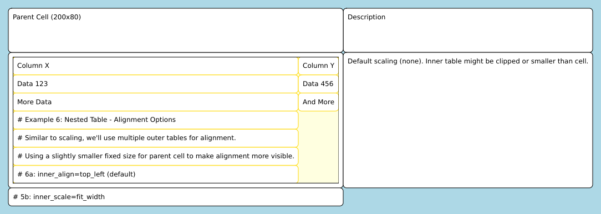

##### Scale Mode: `fit_width`
The parent cell in this example is defined as: `Parent Cell (200x80) ::fixed_width=200:: ::fixed_height=80::`.
The relevant part of the cell definition using the directive is:
```text
::table=inner-table-for-scaling:: ::inner_scale=fit_width:: | Scales to fit width. Height adjusts by aspect ratio.
```
**Rendered Output:**


##### Scale Mode: `fit_height`
The parent cell in this example is defined as: `Parent Cell (200x80) ::fixed_width=200:: ::fixed_height=80::`.
The relevant part of the cell definition using the directive is:
```text
::table=inner-table-for-scaling:: ::inner_scale=fit_height:: | Scales to fit height. Width adjusts by aspect ratio.
```
**Rendered Output:**
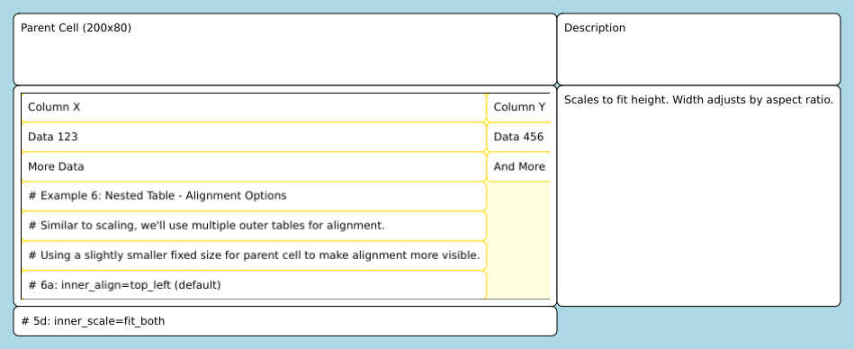

##### Scale Mode: `fit_both`
The parent cell in this example is defined as: `Parent Cell (200x80) ::fixed_width=200:: ::fixed_height=80::`.
The relevant part of the cell definition using the directive is:
```text
::table=inner-table-for-scaling:: ::inner_scale=fit_both:: | Scales to fit both width and height, maintaining aspect ratio.
```
**Rendered Output:**
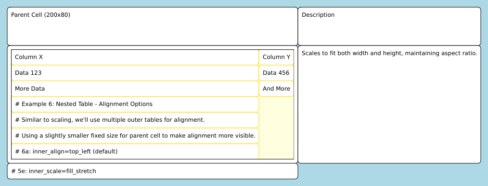

##### Scale Mode: `fill_stretch`
The parent cell in this example is defined as: `Parent Cell (200x80) ::fixed_width=200:: ::fixed_height=80::`.
The relevant part of the cell definition using the directive is:
```text
::table=inner-table-for-scaling:: ::inner_scale=fill_stretch:: | Stretches to fill entire cell, ignoring aspect ratio.
```
**Rendered Output:**
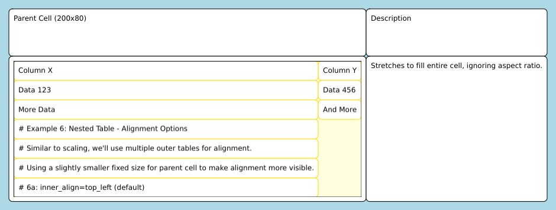
